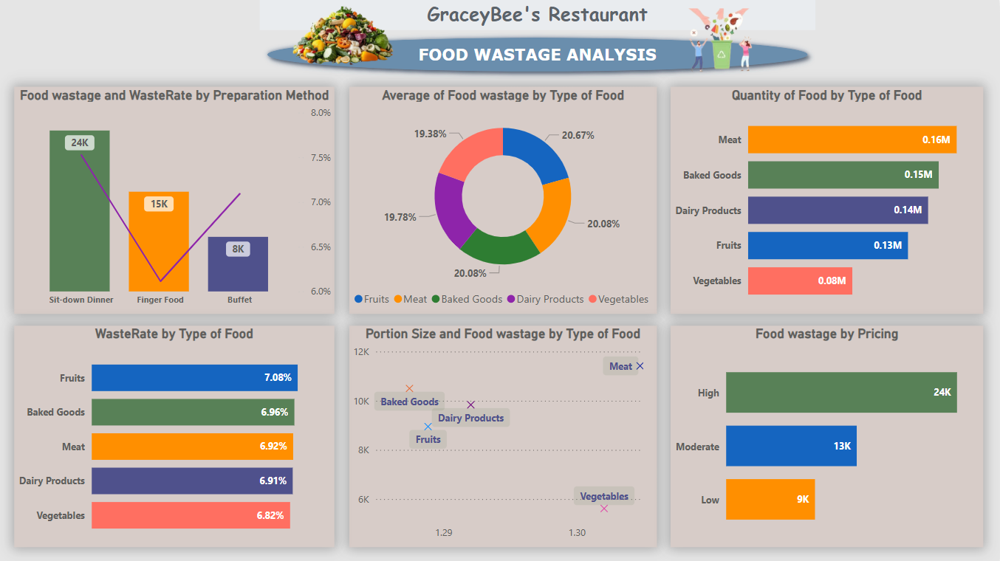
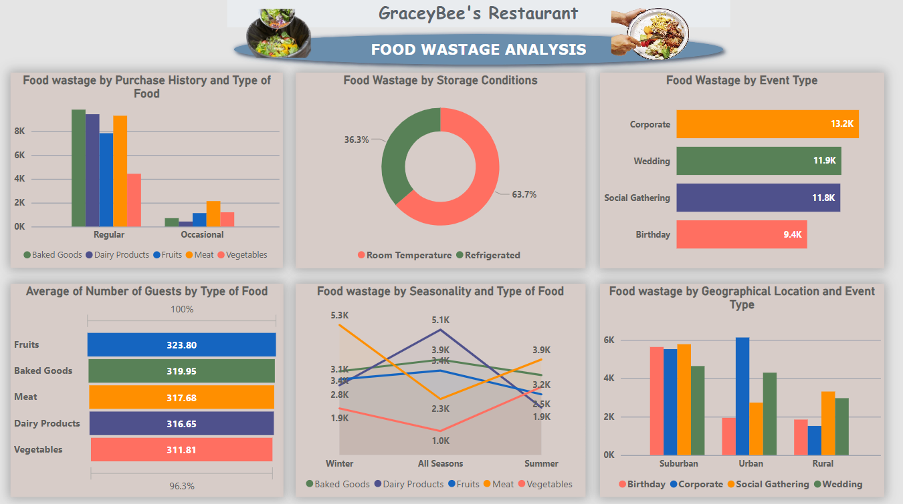

# 🍽️ GraceyBee’s Restaurant: Food Wastage Analysis

**Prepared by:** Akinwumi Oluwatobi  
**Tool Used:** Microsoft Excel, Microsoft Power BI  
**Dataset:** [Food Wastage Dataset from Kaggle](https://www.kaggle.com/datasets/trevinhannibal/food-wastage-data-in-restaurant)  
**Date:** June 2025  

---

## Project Summary

In this project, I analyzed food wastage patterns at GraceyBee’s Restaurant, using a real-world dataset downloaded from Kaggle and visualized with Microsoft Power BI.

The goal was to uncover the root causes of food waste and propose actionable strategies, reduce waste, cut costs, and improve sustainability.

---

## Data Cleaning

Before building the dashboards, I:
- Cleaned and transformed the dataset in Microsoft Excel.
- Removed inconsistencies, missing values, and duplicates.
- Categorized fields by food type, event type, guest count, pricing tier, and more.
- Imported the clean data into Power BI for dynamic visualization and slicing.

---

## Key Business Questions

> 1. What types of food contribute most to wastage?
> 2. Which preparation methods generate the highest waste?
> 3. How do events, seasons, and pricing affect food waste?
> 4. What actionable strategies can help reduce food waste?

---

## Key Insights & Visual Storytelling

### 1️ **Top Waste Contributors**
- **Meat, Baked Goods, and Dairy Products** were the highest in volume of waste.
- Interestingly, **Fruits and Baked Goods** had the highest **waste rates** (efficiency-wise).

 *Insight:* Focus on optimizing procurement and portioning for these categories.

---

### 2️ **Portion Size vs Guest Count**
- All food types served a consistent number of guests (~311–324).
- Larger portion sizes directly correlated with higher wastage.

*Insight:* Reduce portion sizes or offer smaller/half-plate options.

---

### 3️ **Preparation Method Matters**
- **Sit-down dinners** led to the highest waste (24K), followed by **finger food** and **buffets**.
- Also had the highest waste rate across methods.

*Insight:* Reassess portioning in plated meal formats.

---

### 4️ **High Prices, Higher Waste**
- High-priced meals accounted for **24K units** of waste—far above moderate (13K) and low (9K).

*Insight:* Guests may be over-ordering or under-consuming expensive meals.

---

### 5️ **Events & Geography**
- **Corporate and Wedding Events** had the highest waste, especially in **urban and suburban** areas.

*Insight:* Improve forecasting and inventory planning for large-scale events.

---

### 6️ **Storage Conditions**
- Over **63% of waste** came from items stored at **room temperature**.

*Insight:* Improve refrigeration and food holding protocols to reduce spoilage.

---

### 7️ **Seasonality**
- **Fruits peaked in waste during summer**, while **baked goods spiked in winter**.

*Insight:* Tailor menus based on seasonal demand and perishability.

---

## Strategic Recommendations

| Area | Recommendation |
|------|----------------|
| **Portion Control** | Offer flexible portion sizes, smaller plates, and customizable sides. |
| **Menu Optimization** | Reformat high-waste dishes, label low-waste meals, and monitor dish performance. |
| **Event Planning** | Use forecasting tools and confirm guest numbers ahead of large events. |
| **Storage Management** | Invest in refrigeration, apply FIFO (first-in, first-out), and monitor food holding time. |
| **Leftover Utilization** | Create daily specials, soups, or sauces with leftovers, following hygiene SOPs. |
| **Staff Engagement** | Train staff, set KPIs for waste reduction, and track progress via checklists. |

---

## Visuals

### Dashboard 1 – High-Level Overview  

### Dashboard 2 – Deep Dive into Food Types and Waste Rates  

---

## Impact

With these insights, **GraceyBee’s Restaurant** can expect to:
- Reduce food waste significantly,
- Enhance profitability,
- Strengthen sustainability efforts, and
- Improve customer satisfaction through better-planned offerings.

---

----
🙋‍♂️ Author
-  **Oluwatobi Akinwumi**
-  Auditor & Data Analyst
- 📍 Abuja, Nigeria
-  +2348064549683
-  📧 tobbysam247@gmail.com
